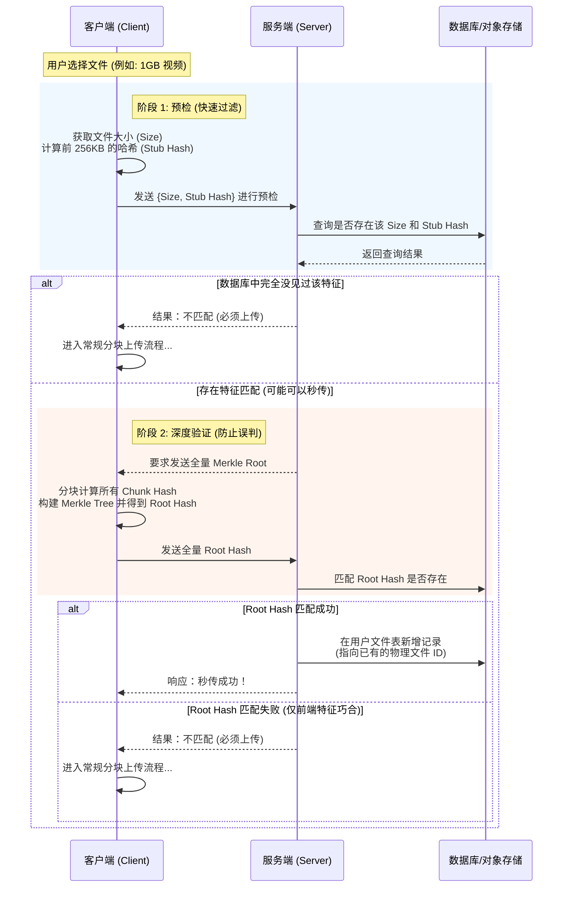

```mermaid
sequenceDiagram
    participant C as 客户端 (Client)
    participant S as 服务端 (Server)
    participant DB as 数据库/对象存储

    Note over C: 用户选择文件 (例如: 1GB 视频)

    rect rgb(240, 248, 255)
    Note right of C: 阶段 1: 预检 (快速过滤)
    C->>C: 获取文件大小 (Size)<br/>计算前 256KB 的哈希 (Stub Hash)
    C->>S: 发送 {Size, Stub Hash} 进行预检
    S->>DB: 查询是否存在该 Size 和 Stub Hash
    DB-->>S: 返回查询结果
    end

    alt 数据库中完全没见过该特征
        S-->>C: 结果：不匹配 (必须上传)
        C->>C: 进入常规分块上传流程...
    else 存在特征匹配 (可能可以秒传)
        rect rgb(255, 245, 238)
        Note right of C: 阶段 2: 深度验证 (防止误判)
        S-->>C: 要求发送全量 Merkle Root
        C->>C: 分块计算所有 Chunk Hash<br/>构建 Merkle Tree 并得到 Root Hash
        C->>S: 发送全量 Root Hash
        S->>DB: 匹配 Root Hash 是否存在
        end

        alt Root Hash 匹配成功
            S->>DB: 在用户文件表新增记录<br/>(指向已有的物理文件 ID)
            S-->>C: 响应：秒传成功！
        else Root Hash 匹配失败 (仅前端特征巧合)
            S-->>C: 结果：不匹配 (必须上传)
            C->>C: 进入常规分块上传流程...
        end
    end
```