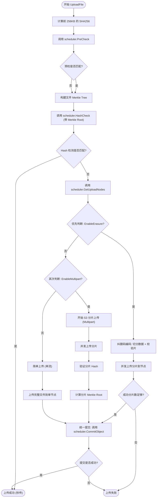

## 上传流程图

```mermaid
flowchart TD
    Start(["开始 UploadFile"]) --> PreCheckCalc["计算前 256KB 的 SHA256"]
    PreCheckCalc --> PreCheckReq["调用 scheduler.PreCheck"]
    PreCheckReq --> PreCheckMatch{"预检是否匹配?"}
    
    PreCheckMatch -- "是" --> BuildMerkle["构建文件 Merkle Tree"]
    PreCheckMatch -- "否" --> BuildMerkle
    
    BuildMerkle --> HashCheckReq["调用 scheduler.HashCheck (带 Merkle Root)"]
    HashCheckReq --> HashCheckMatch{"Hash 检测是否匹配?"}
    
    HashCheckMatch -- "是" --> Success(["上传成功 (秒传)"])
    HashCheckMatch -- "否" --> GetNodes["调用 scheduler.GetUploadNodes"]
    
    GetNodes --> CheckEC{"优先判断: EnableErasure?"}
    
    %% Erasure Coding Path (Priority 1)
    CheckEC -- "是" --> ECEncoding["纠删码编码: 切分数据 + 校验片"]
    ECEncoding --> UploadShards["并发上传分片到节点"]
    UploadShards --> CheckSuccess{"成功分片数足够?"}
    CheckSuccess -- "是" --> UnifiedCommit
    CheckSuccess -- "否" --> Fail["上传失败"]
    
    %% Multipart / Simple Path
    CheckEC -- "否" --> CheckMultipart{"其次判断: EnableMultipart?"}
    
    %% Multipart Upload Path (Priority 2)
    CheckMultipart -- "是" --> MultipartUpload["开始 S3 分片上传 (Multipart)"]
    MultipartUpload --> UploadParts["并发上传分片"]
    UploadParts --> VerifyParts["验证分片 Hash"]
    VerifyParts --> CalcRoot["计算分片 Merkle Root"]
    CalcRoot --> UnifiedCommit
    
    %% Simple Upload Path (Priority 3)
    CheckMultipart -- "否" --> SimpleUpload["简单上传 (单流)"]
    SimpleUpload --> SimpleUploadExec["上传完整文件到单节点"]
    SimpleUploadExec --> UnifiedCommit
    
    %% Unified Commit
    UnifiedCommit["统一提交: 调用 scheduler.CommitObject"] --> CommitSuccess{"提交是否成功?"}
    CommitSuccess -- "是" --> Success
    CommitSuccess -- "否" --> Fail(["上传失败"])
```